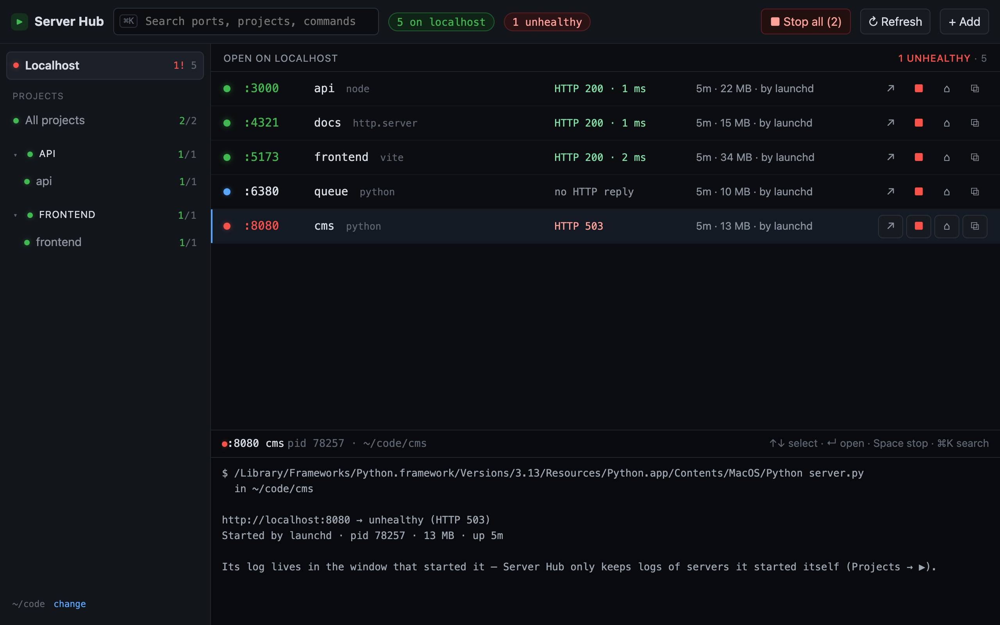
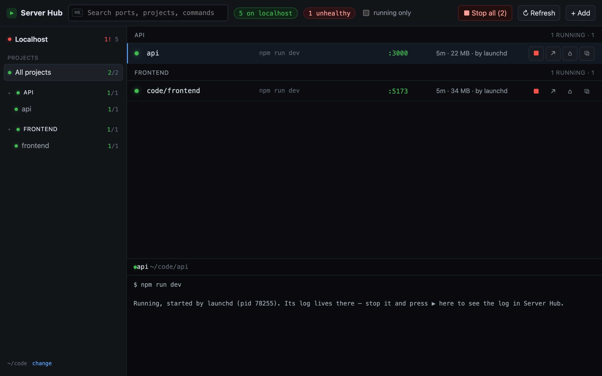

<p align="center"></p>

<h1 align="center">Server Hub</h1>

<p align="center"><b>See every localhost server on your Mac — and whether it actually works.</b><br>
Free for macOS · no account · nothing leaves your computer</p>

<p align="center">
  <a href="https://github.com/nvminhtu/server-hub/releases/latest/download/Server-Hub-mac.dmg"><b>⬇ Download for Mac</b></a> ·
  <a href="https://github.com/nvminhtu/server-hub/releases">Releases</a>
</p>

Running a frontend, an API, a CMS and a docs site at once? Server Hub lists every port open on localhost,
checks each one with a quick HTTP request, and tells you which are **healthy**, which are **broken**
(5xx or no answer) and which aren't web servers at all. Open, stop or find the folder of any of them in one click —
no more `lsof -i :3000` and hunting through terminal tabs.



## Download

| Platform | File | Size |
|---|---|---|
| **macOS** 11 or later, Apple silicon & Intel | [Server-Hub-mac.dmg](https://github.com/nvminhtu/server-hub/releases/latest/download/Server-Hub-mac.dmg) | 4 MB |

The link always gives you the newest version. Older versions and checksums (`SHA256SUMS.txt`):
[Releases](https://github.com/nvminhtu/server-hub/releases).

## Install

1. Open **Server-Hub-mac.dmg** and drag **Server Hub** onto the **Applications** folder.
2. Open **Server Hub** from Applications.
3. The first time, macOS says *"Server Hub" Not Opened – Apple could not verify…*. Click **Done**.
   This version is not notarized by Apple yet; a notarized build is on the way.
4. Open **System Settings → Privacy & Security**, scroll down to *"Server Hub" was blocked…* and click
   **Open Anyway**, then enter your Mac password and click **Open**.
5. That's it. From now on it opens normally.

<details><summary>Still blocked? (advanced)</summary>

In Terminal, remove the download flag, then open the app again:

```bash
xattr -dr com.apple.quarantine "/Applications/Server Hub.app"
```
</details>

**Uninstall:** quit Server Hub from its menu bar icon, then drag it from Applications to the Trash.

## What it does

**Localhost** — every TCP port listening on your Mac that a browser could open (dev servers, local APIs, databases),
refreshed every few seconds:

- 🟢 **healthy** — answers HTTP with a status below 500, with response time
- 🔴 **unhealthy** — HTTP 5xx, or the port is open but nothing answers
- 🔵 **not a web page** — the port is alive but speaks another protocol (Postgres, Redis, adb…)
- Name of the project folder, the tool (vite, next, astro, http.server, uvicorn…), uptime, memory, and **who started it**
  (Terminal, iTerm, VS Code, Cursor, Claude Code, Codex…)
- ↗ open in browser · ■ stop (asks twice, never stops macOS system processes) · ⌂ open folder · ⧉ copy URL

**Menu bar** — the number of open ports (e.g. `5 · 1!` when one of them is unhealthy); click one to open it.

**Projects** — choose your projects folder once. Server Hub finds everything that can run inside it
(`package.json` with `dev`/`start`, `.claude/launch.json`, `run.sh`) so you can **▶ start** and **■ stop** each one,
read its live log, and see when two projects want the same port. Add anything else by hand with **+ Add**.



Keyboard: `⌘K` search · `↑↓` select · `Space` start/stop · `↵` open in browser.

## Privacy

Server Hub runs only on your Mac. It reads the list of listening ports and processes (`lsof`, `ps`), sends health
checks only to `localhost`, and saves your settings in `~/Library/Application Support/server-hub/`. No account,
no analytics, no network calls to anyone else.

## Feedback

Found a bug or want a feature? [Open an issue](https://github.com/nvminhtu/server-hub/issues).
