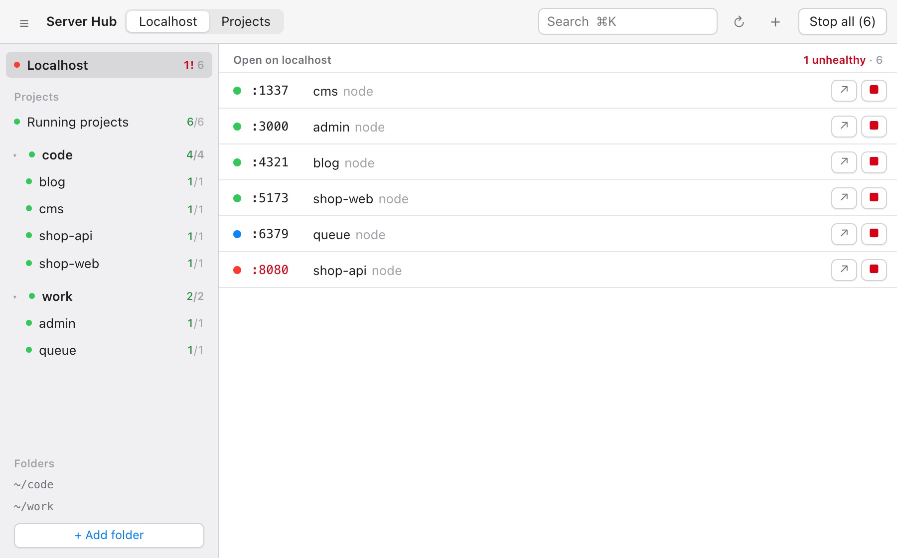

<p align="center"></p>

<h1 align="center">Server Hub</h1>

<p align="center"><b>See every localhost server on your Mac — and whether it actually works.</b><br>
Free and open source (MIT) for macOS · Apple silicon & Intel · no account · nothing leaves your network</p>

<p align="center">
  <a href="https://github.com/nvminhtu/server-hub/releases/latest/download/Server-Hub-mac.dmg"><b>⬇ Download for Mac</b></a> ·
  <a href="#install">Install</a> ·
  <a href="#faq">FAQ</a> ·
  <a href="https://github.com/nvminhtu/server-hub/releases">Releases</a>
</p>

Running a frontend, an API, a CMS and a docs site at the same time? Server Hub shows every port open on
localhost, sends each one a quick HTTP request, and tells you which ones are **healthy**, which are **broken**
(5xx or no answer) and which aren't web servers at all. You can open, stop or find the folder of any of them in one click,
and start your projects with ▶. No more `lsof -i :3000`, no more digging through terminal tabs to find which one
holds port 5173.


<sub>Screenshots use a sample stack (`shop-web`, `shop-api`, `cms`, `blog`, `admin`, `queue`) in `~/code` and `~/work`.</sub>

---

## Contents

- [Features](#features)
- [Download](#download)
- [Install](#install)
- [Getting started](#getting-started)
- [Share on your local network](#share-on-your-local-network)
- [How it works](#how-it-works)
- [Keyboard shortcuts](#keyboard-shortcuts)
- [Privacy](#privacy)
- [FAQ](#faq)
- [Troubleshooting](#troubleshooting)
- [Uninstall](#uninstall)
- [Build from source](#build-from-source)
- [Feedback](#feedback)
- [License](#license)

## Features

### Localhost — what is running right now

Every TCP port on your Mac that a browser could open: dev servers, local APIs, databases. The list
refreshes every few seconds.

| Dot | Meaning |
|---|---|
| 🟢 **healthy** | answers HTTP with a status below 500; the response time is shown |
| 🔴 **unhealthy** | answers with HTTP 5xx, or the port is open but nothing answers |
| 🔵 **not a web page** | the port is alive but speaks another protocol (Postgres, Redis, adb…) |

Each row also shows:

- the **project folder name** and the **tool** behind it: vite, next, astro, nuxt, webpack, http.server, uvicorn,
  django, rails, angular and others
- **uptime** and **memory**
- **who started it**: Terminal, iTerm, Warp, Ghostty, VS Code, Cursor, Xcode, Claude Code, Codex, or Server Hub itself

Row buttons: **↗** open in the browser · **⇄** [share on your local network](#share-on-your-local-network) · **■** stop (click twice to confirm) · **⌂** open the folder in Finder · **⧉** copy the URL.

Server Hub never stops macOS system processes.

### Projects — start and stop what you build


- **Only what runs, by default.** The list and the sidebar show running projects only, so a folder with 30 projects
  doesn't bury the 3 you are using. Tick **Show all** in the top bar to see every project, stopped ones included
  (Server Hub remembers the choice).
- **Add one or more project folders** (`~/code`, `~/work`, `~/Developer`…). Server Hub finds everything that can
  run inside them:
  - `package.json` with a `dev` or `start` script that starts a server (vite, next, astro, node, webpack…)
  - `.claude/launch.json` (the file Claude Code uses to start dev servers)
  - `run.sh`
- **▶ Start** runs the command in the right folder, using the same `PATH` as your terminal (Homebrew, nvm, fnm, volta…).
  **■ Stop** shuts down the whole process group, so npm, vite and esbuild all exit together.
- **Live log** for everything you start from Server Hub: the last 2,000 lines, with errors in red and "ready" lines in green.
- **Health in the list:** a project that is running but returns 5xx gets a red dot.
- **Port clash warning** when two projects want the same port, with the name of whoever holds it.
- **■ Stop all** asks first and lists every server it will stop.
- **+ Add** a server by hand (name, folder, command, port) for anything Server Hub can't detect.

### Menu bar

The menu bar shows how many ports are open, e.g. `6`, or `6 · 1!` when one of them is unhealthy. Click it to see every
port with its status dot and open one in the browser, or stop a running project. If you close the window,
Server Hub keeps running in the menu bar. Quit it from the menu bar icon.

## Download

| Platform | File | Size |
|---|---|---|
| **macOS 11 Big Sur or later**, Apple silicon & Intel (universal) | [Server-Hub-mac.dmg](https://github.com/nvminhtu/server-hub/releases/latest/download/Server-Hub-mac.dmg) | ~6 MB |

This link always downloads the newest version. Older versions and checksums (`SHA256SUMS.txt`) are on the
[Releases](https://github.com/nvminhtu/server-hub/releases) page. To check your download:

```bash
shasum -a 256 ~/Downloads/Server-Hub-mac.dmg
```

## Install

1. Open **Server-Hub-mac.dmg** and drag **Server Hub** onto the **Applications** folder.
2. Open **Server Hub** from Applications. That's it.

Server Hub is signed with a Developer ID and notarized by Apple (since 0.2.1), so it opens without a warning.
Using an older version (0.2.0 or earlier) and macOS blocks it? Go to **System Settings → Privacy & Security** and click
**Open Anyway**, or just download the newest version.

## Getting started



1. **Open Server Hub.** The **Localhost** list works right away; there's nothing to set up.
2. **Add your projects folder.** Open the sidebar (**☰** or `⌘B`), click **+ Add projects folder…** and pick the folder that holds your
   projects, e.g. `~/code`. If you keep projects in several places, use **+ Add folder** at the bottom of the
   sidebar to add more.
3. **Start something.** Go to the **Projects** tab, tick **Show all**, select a project and press **▶** (or `Space`). Its log appears at
   the bottom. When it's ready, press **↗** (or `↵`) to open it in the browser.
4. **Keep an eye on it.** Glance at the menu bar: if a `!` shows up, one of your servers stopped answering properly.

To stop scanning a folder, hover over it under **Folders** and click **×** twice. Your files are not touched;
the folder's projects just leave the list.

## Share on your local network

Want to open your dev site on your phone, or show it to a teammate on the same Wi-Fi? Press **⇄** on a running row.

- If the server already listens on every address (`*:8080`), Server Hub copies its LAN link, e.g. `http://192.168.1.20:8080`.
- If it listens on `127.0.0.1` only (vite, next dev and most dev servers do by default), Server Hub opens a small relay on
  port + 10000 and copies that link: `5173 → http://192.168.1.20:15173`.
- A blue **⇄** means the row is reachable from the network; the link is shown in the row. Click it twice to stop sharing.
- Relays close by themselves when the server stops or when you quit Server Hub. Nothing is exposed to the internet:
  only devices on your local network can connect.
- The first time, macOS may ask whether Server Hub may accept incoming connections. Click **Allow**.

## How it works

- **Ports:** `lsof` lists the TCP ports in LISTEN state; `ps` gives the process, its folder, uptime and memory.
- **Health check:** Server Hub opens a connection to `127.0.0.1:<port>` (or `[::1]`), sends `HEAD /` and reads the
  status line. The timeout is 0.7 s and each result is reused for 4 s, so it stays light even with dozens of ports.
- **Who started it:** Server Hub walks up the process tree until it finds a known app (Terminal, VS Code…).
  If the starting terminal was closed, the process belongs to `launchd`.
- **Finding projects:** Server Hub scans your folders up to 10 levels deep and skips `node_modules`, `.git`, `dist`,
  `build`, `target`, `Pods` and similar folders. Projects that sit directly inside a folder are grouped under that folder's name.

## Keyboard shortcuts

| Keys | Action |
|---|---|
| `⌘K` | search ports, projects, commands (type `:5173` to find a port) |
| `↑` `↓` | select a row |
| `Space` | start / stop the selected row |
| `↵` | open the selected row in the browser |
| `Esc` | clear search, close dialogs |
| double-click a row | start / stop |

## Privacy

Server Hub runs only on your Mac.

- It reads the list of listening ports and processes (`lsof`, `ps`) and the project files in the folders **you** add.
- Health checks go **only to localhost**.
- Sharing (⇄) is off until you press it, and only reaches devices on your local network.
- It saves its settings (your folder list and servers you added by hand) in
  `~/Library/Application Support/server-hub/`.
- No account, no analytics, no tracking, no network calls to anyone else.

## FAQ

**Is it free?**
Yes.

**Does it work on Intel Macs?**
Yes. The download is a universal app for Apple silicon and Intel, macOS 11 or later.

**Why isn't it on the Mac App Store?**
Mac App Store apps run in a sandbox that doesn't allow starting or stopping other programs, and that's the core job of
Server Hub.

**A port I know is running doesn't show up.**
Server Hub hides macOS system services and ordinary apps (Spotify, Dropbox…) that happen to open a port. Dev runtimes
(node, python, ruby, java, php, go, deno, bun…) and anything inside your project folders are always shown. Press
**↻ Refresh** if it was started a second ago.

**What counts as "unhealthy"?**
An HTTP status of 500 or higher, or an open port that doesn't answer within 0.7 s. A 404 counts as **healthy**, because
the server answered; it just has nothing at `/`.

**Can I see the log of a server I started in Terminal?**
No. The log lives in the window that started it. Stop the server there, then start it with ▶ in Server Hub; from then on
Server Hub shows its log.

**My project isn't detected.**
Server Hub looks for `package.json` `dev` / `start` scripts that start a server, `.claude/launch.json` and `run.sh`. For
anything else, use **+ Add** and type the folder, the command and the port.

**Is it safe to press Stop?**
■ sends the normal "please quit" signal (SIGTERM), then force-quits after 3 seconds if the process is still running,
just like pressing Ctrl+C in a terminal. Server Hub refuses to stop macOS system processes.

## Troubleshooting

| Problem | Fix |
|---|---|
| macOS says the app can't be opened | Download the newest version (signed + notarized). Older builds: System Settings → Privacy & Security → **Open Anyway**. |
| ▶ Start fails with "command not found" | Server Hub uses your login shell's `PATH`. Make sure the tool (npm, pnpm, python…) works in a **new** Terminal window, then quit and reopen Server Hub. |
| "port 5173 is already in use by pid …" | Something else already holds that port. Find it in **Localhost**, stop it, then press ▶ again. |
| The list is empty | Press **↻ Refresh**. If it stays empty, no dev server is running yet. |
| I closed the window and the app is still running | That's intended: it keeps watching from the menu bar. Click the menu bar icon → **Open Server Hub**, or **Quit Server Hub**. |

## Uninstall

1. Click the Server Hub icon in the menu bar → **Quit Server Hub**.
2. Drag **Server Hub** from Applications to the Trash.
3. Optional: also remove its settings in `~/Library/Application Support/server-hub/`.

## Build from source

You need macOS, [Node.js](https://nodejs.org) 20+ and [Rust](https://rustup.rs).

```bash
git clone https://github.com/nvminhtu/server-hub && cd server-hub
npm ci
npm test                 # core tests (Rust)
npm run app              # run the app in dev mode
npx tauri build --bundles app,dmg   # → src-tauri/target/release/bundle/
```

| Folder | What's inside |
|---|---|
| `core/` | Rust: find runnable projects (`scan.rs`), ports and processes (`procs.rs`), health checks (`health.rs`), LAN relay (`share.rs`), start / stop / logs (`api.rs`) |
| `src/` | the UI: plain TypeScript + Vite |
| `src-tauri/` | the macOS shell and the menu bar icon (Tauri 2) |

Try the UI in a browser without building the app: `npm run bridge` (API on :4410) and `npm run dev` (http://localhost:1450).

Signed + notarized release from your own Mac (Developer ID certificate in the keychain): `./scripts/release-signed.sh`.

Releases are built by GitHub Actions (`.github/workflows/release.yml`): bump `version` in `package.json` and
`src-tauri/tauri.conf.json`, add a section to `CHANGELOG.md`, push to `main`.

## Feedback

Found a bug or want a feature? [Open an issue](https://github.com/nvminhtu/server-hub/issues). Include your macOS version
and, if you can, a screenshot.

## License

[MIT](LICENSE) © nvminhtu. Free to use, change and share.
